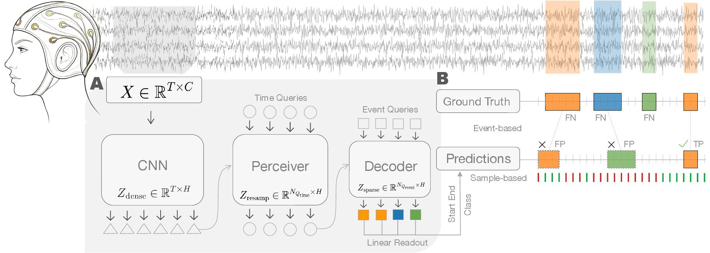

# DANCE: Detect and Classify Events in EEG

`Dance` is an end-to-end framework that **detects** and **classifies** events in EEG signals. In a single forward pass, it extracts a **set of events** directly from the raw, unaligned recording.

This repository is the official implementation of the [DANCE](https://arxiv.org/abs/2605.10688) paper.

<p align="center">
  
</p>

This repository contains:

- A **standalone DANCE model** — [`dance.Dance`](dance/dance.py): a single `nn.Module` that wraps the architecture and the full loss stack. Pass it a batch dict, get predictions and the training loss in one call. Use it directly with your own dataloader.
- The **DANCE architecture** — CNN encoder, Perceiver bottleneck and DETR-style decoder with learnable event queries ([`dance/models/`](dance/models/), [`dance/matcher.py`](dance/matcher.py)).
- The **training and evaluation pipeline** — losses, metrics, Lightning module, dataloader plumbing and CLI ([`dance/losses.py`](dance/losses.py), [`dance/metrics.py`](dance/metrics.py), [`dance/main.py`](dance/main.py)).
- **3 example datasets** with full configs ready to run, demonstrating the breadth of paradigms DANCE supports:
  - **P300** — [Korczowski et al. 2019 (BI2014a)](https://zenodo.org/record/3266222)
  - **Motor imagery** — [Tangermann et al. 2012 (BNCI2014_001)](https://www.bbci.de/competition/iv/)
  - **Seizure classification** — [Shah et al. 2018 (TUSZ v2.0.3)](https://isip.piconepress.com/projects/tuh_eeg/)

## Installation

```console
git clone https://github.com/<your-org>/dance
cd dance
pip install -e .
```

## Use DANCE in your own pipeline

You can use DANCE as a single `nn.Module`. You need to pass a batch dict and you get back predictions and (when targets are present) the training loss in one call. A runnable end-to-end example on MOABB BI2014b lives in [`dance/example/`](dance/example/) (`pip install moabb && python dance/example/train.py`).

```python
import torch
from dance import Dance

model = Dance(n_channels=16, n_classes=3, n_queries=150, duration=32.0)
optimizer = torch.optim.AdamW(model.parameters(), lr=5e-5)

for batch in your_dataloader:
    out = model(batch)
    out["loss"].backward()
    optimizer.step()
    optimizer.zero_grad()
```

Each batch is a dict of tensors:

| key | shape | dtype | meaning |
|---|---|---|---|
| `eeg` | `(B, n_channels, T)` | float | raw EEG |
| `channel_positions` | `(B, n_channels, 2)` | float | normalised (x, y) electrode coordinates |
| `start`, `end` | `(B, max_events)` | float in `[0, 1]` | event spans normalised to the window (zero-pad unused slots) |
| `class` | `(B, max_events)` | long | class id per event (0 = padding / no-event) |

The model returns `{loss, loss_details, pred_class, pred_start, pred_end, pred_dense}`. For inference, pass only `eeg` and `channel_positions` — only the `pred_*` keys are returned. The full implementation is one file: [`dance/dance.py`](dance/dance.py).

If you don't have electrode positions for your dataset, instantiate `Dance(..., use_channel_merger=False)` to skip the ChannelMerger and feed the raw channels directly; the `channel_positions` key then becomes unnecessary.

## Quickstart

List the example datasets, then launch a 1-epoch sanity run on the smallest one (P300, ~24 subjects, a few minutes on a single GPU):

```console
dance list-datasets                          # See what's available
dance run korczowski2014a --debug            # Quick local sanity check
```

To reproduce the results reported in the paper on the three datasets:

```console
dance run korczowski2014a --submit           # 5 jobs  (1 seed × 5 folds)
dance run tangermann2012  --submit           # 5 jobs  (1 seed × 5 folds)
dance run shah2018        --submit \         # 3 jobs  (3 seeds, 8-GPU DDP, official train/dev/eval split)
    --study-path /path/to/your/tuh_eeg_corpus
```

`--submit` dispatches to SLURM via [submitit](https://github.com/facebookincubator/submitit). Use `--local` instead if you don't have SLURM and want to iterate the same grid sequentially on a single machine. Datasets shipped via [MOABB](https://moabb.neurotechx.com/) are downloaded on first use into a per-user cache (`--cache-folder`, default `$XDG_CACHE_HOME/dance`). TUSZ requires a one-time manual registration with the [TUH EEG Corpus](https://isip.piconepress.com/projects/tuh_eeg/) — once you have the data on disk, point `--study-path` at it.

## Reference results

Two F1s are reported, both as per-subject mean ± SEM:

- **F1-sample** — per-timestep multilabel macro F1.
- **F1-event** — class-aware F1 over event spans at IoU > 0.5.

<div align="center">

| Dataset | F1-sample | F1-event |
|---|---|---|
| Korczowski et al. 2019 (BI2014a) — P300 | 0.651 ± 0.005 | 0.525 ± 0.003 |
| Tangermann et al. 2012 (BNCI2014_001) — Motor imagery | 0.551 ± 0.019 | 0.462 ± 0.021 |
| Shah et al. 2018 (TUSZ) — Seizure | 0.255 ± 0.010 | 0.248 ± 0.044 |

</div>

Per-subject predictions are dumped to `<folder>/<run>/callbacks/test_batch_predictions*.json`. For full ablations and baselines, see [DANCE](https://arxiv.org/abs/2605.10688).

## Tutorial: integrating a new dataset

The pipeline is designed to be opened up and dropped onto a new dataset with minimal glue. Two steps:

**1. Make sure your dataset is exposed as a [`neuralset.events.Study`](https://github.com/facebookresearch/neuroai/tree/main/neuralset-repo).** `dance` builds on top of [`neuralset`](https://github.com/facebookresearch/neuroai/tree/main/neuralset-repo) (data layer) and [`neuraltrain`](https://github.com/facebookresearch/neuroai/tree/main/neuraltrain-repo) (training infrastructure). Most public EEG datasets are already exposed through [`neuralfetch.studies`](https://github.com/facebookresearch/neuroai/tree/main/neuralfetch-repo), including the three example datasets above — in that case there's nothing to write. If your dataset isn't there yet, head to the [neuralset documentation](https://facebookresearch.github.io/neuroai/) and follow their *Adding a Study* guide; `dance` will pick it up automatically once it's a registered `Study` subclass.

**2. Drop a YAML in [`dance/configs/datasets/`](dance/configs/datasets/).** It overrides only what differs from [`dance/configs/defaults.yaml`](dance/configs/defaults.yaml). For a new P300-style dataset called `myp300`:

```yaml
# dance/configs/datasets/myp300.yaml
data:
  study:
    name: MyP300Study           # neuralfetch.events.Study subclass name
  duration: 8.0                  # window length in seconds
  features:
    feature_class:
      event_types: Stimulus
      mapping: {"<no_event>": 0, NonTarget: 1, Target: 2}
    dense_target:
      event_types: Stimulus
      mapping: {"<no_event>": 0, NonTarget: 1, Target: 2}
decoder_config:
  n_queries: 150                 # tune to expected event count per window
```

```console
dance run myp300 --debug                     # Validate locally
dance run myp300 --submit                    # Full grid
```

That's it — the rest of the pipeline (extractors, matcher, model, trainer, callbacks, W&B logging) is dataset-agnostic.

For tasks that need light event-table cleaning (e.g. dropping background events, deduplicating per-channel annotations), subclass [`neuralset.events.EventsTransform`](https://github.com/facebookresearch/neuroai/tree/main/neuralset-repo) and reference it from the YAML's `data.preprocessor` field — see [`dance/transforms.py`](dance/transforms.py) (`SeizurePreprocessor`) for a worked example.

## Weights & Biases

Logging is on by default. Set the host once:

```console
wandb login --host https://your.wandb.host
```

Each `dance run` invocation accepts `--project`, `--wandb-host`, and (for grid modes) implicitly uses `--grid-name` as the W&B group. Pass an empty `--wandb-host ""` to disable logging entirely; results still land under `--folder` and remain accessible offline.

## Contributing

We welcome bug reports, feature requests and pull requests from the wider neuroscience and ML communities — adding a new dataset, a new model variant, or sharpening the documentation are all in scope. See [CONTRIBUTING.md](CONTRIBUTING.md) for the pull-request workflow and CLA pointer, and [CODE_OF_CONDUCT.md](CODE_OF_CONDUCT.md) for community standards.

## Citing

If you use `dance` in your research, please cite:

```bibtex
@article{levy2026dance,
  title   = {DANCE: Detect and Classify Events in EEG},
  author  = {L{\'e}vy, Jarod and Banville, Hubert and Rapin, J{\'e}r{\'e}my and King, Jean-R{\'e}mi and Moreau, Thomas and d'Ascoli, St{\'e}phane},
  year    = {2026},
  journal = {arXiv preprint arXiv:2605.10688},
  url     = {https://arxiv.org/abs/2605.10688},
}
```

## Third-party content

Third-party datasets and pretrained components pulled from external sources are subject to their own licenses; check each dataset's link above for terms of use.

## License

`dance` is MIT licensed, as found in the [LICENSE](LICENSE) file. Also see Meta Open Source [Terms of Use](https://opensource.fb.com/legal/terms) and [Privacy Policy](https://opensource.fb.com/legal/privacy).
